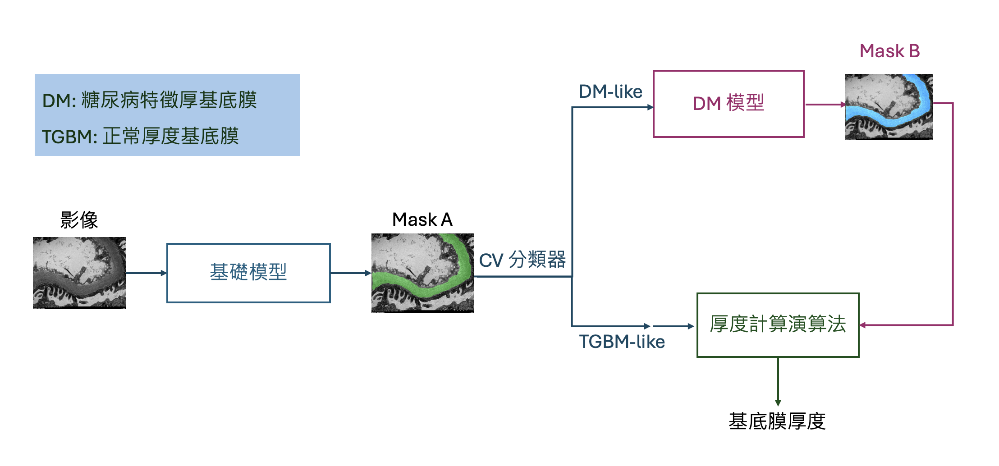
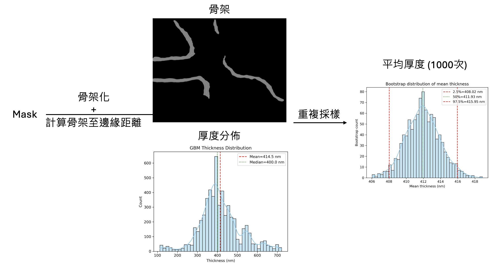

# GlomeTrace-AI

本作品建立一套基於深度學習的醫學影像分析方法，可自動辨識電子顯微鏡影像中的目標結構並進行影像分割，並以演算法自動計算腎絲球基底膜厚度，協助研究人員快速分析大量影像資料。
系統主要功能包括：
1. **自動影像分割**  
透過深度學習模型訓練，自動辨識影像中的目標結構並產生分割結果，降低人工標註與分析所需時間。
2. **多模型比較分析**  
比較YOLO、HRNet與SAM三種模型在醫學影像任務中的表現，分析其分割完整性與穩定性差異。
3. **參數影響分析**  
分析不同模型參數對結果的影響，包括信心分數、訓練資料量、影像解析度與learning rate。
4. **模型最佳化建議**  
透過系統化實驗結果，提出適合醫學影像分割的模型與參數設定方向。
整體而言，本作品建立了一套完整的AI醫學影像分析流程，可有效提升影像分析效率與穩定性。
5. **基底膜厚度計算**  
透過影像處理演算法，本作品開發了一套計算分割區域厚度的演算法，完整了自影像分割至厚度計算的流程。
  
  
  
### 模型流程圖

  
### 厚度計算流程

---
#### 使用方法
1. 請先至 [雲端](https://drive.google.com/file/d/1uszqjG0eNj8xi8tqTBilCwoXdaNyKi96/view?usp=drive_link) 下載模型權重
2. 如欲訓練模型，請使用 train_hrnet.py
3. 如欲推論影像，請使用 val.py
4. 計算基底膜厚度，請使用 measure.py
5. 分析由 4. 跑出來的數據，請使用 statistic.py
